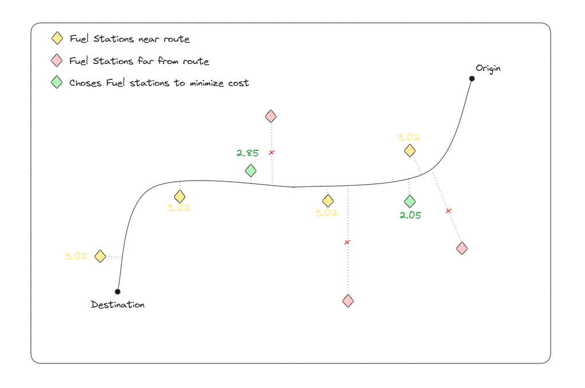

# Fuel Route Optimizer API

This is an Implementation of a route optimization API for trucks in the USA that aims to Optimize route taken by a truck to account for optimal fuel cost.

## How it works

1. The API calls for operroutesapi to find a route from origin to destination.
2. Calculate distance from route to fuel station to find nearby ones (candidate stops in yellow)
3. A greedy algorithim to select fueling stops for minimum cost (chosen stops in green).

## How to Use

1. Create and activate python environment

2. Install pipenv `pip install pipenv`

3. Install dependencies `pipenv install`

4. Run the django app `python manage.py runserver`
